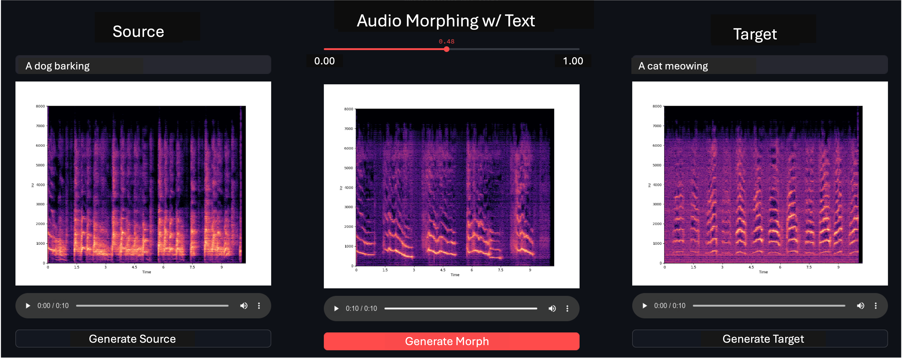

# MorphFader: Enabling Fine-Grained Semantic Control for Text-to-Audio Morphing through Fader-like Interactions


This project is part of a paper titled "MorphFader: Enabling Fine-grained Controllable Morphing with Text-to-Audio Models" under review.

[Paper](https://arxiv.org/pdf/2408.07260) | [Demo Webpage](https://pkamath2.github.io/audio-morphing-with-text/webpage/index.html) | [Citation](#citation)



In this paper, we outline an interactive method to morph sounds generated by two text prompts. We leverage existing pre-trained text-to-audio models such as AudioLdm. By interpolating between the components of the cross-attention layers of the diffusion models for the two prompts, we show that we can generate smooth and novel interpolated or morphed sounds. 

This repo is based on the AudioLDM codebase. We use the pre-trained model labeled as 'audioldm_16k_crossattn_t5'. See [here](https://github.com/haoheliu/AudioLDM2).

### Table of Contents

* [Setup](#setup) 
* [Notebooks](#notebooks) 
* [Streamlit Interfaces](#interfaces) 
* [Citing this work](#citation)


### Setup
* Clone this repo
* Install dependencies (from the original AudioLDM repo as shown below) by creating a new conda environment called ```interactive-audio-morphing```
```
conda create -n interactive-audio-morphing python=3.8; conda activate interactive-audio-morphing
pip3 install git+https://github.com/haoheliu/AudioLDM2.git
pip3 install streamlit==1.31.1
```
Add the newly created environment to Jupyter Notebooks
```
python -m ipykernel install --user --name interactive-audio-morphing
```

### Notebooks
Notebooks outline how to semantically weight adjective or verb descriptors in the text prompts (see paper). Furthermore, they outline how to morph between two text prompts.

* [Notebook to demonstrate semantic word weighting](notebooks/explore_word_weighting.ipynb)
* [Notebook to demonstrate audio morphing between text prompts](notebooks/explore_morphing.ipynb)
  
Alternatively, please see our webpage for Google Colab notebooks. 


### Interfaces
We demonstrate the interactivity of our algorithms by developing two proof-of-concept interfaces using [Streamlit](https://streamlit.io/)  

To run the interfaces - 
```
cd interface
streamlit run app.py
```

You will be able to access the interfaces via browser (preferably use Chrome or Firefox) using the following urls:
* For semantic word weighting [http://localhost:8501/sound_design_ldm/?app=weight](http://localhost:8501/sound_design_ldm/?app=weight)
* For audio morphing [http://localhost:8501/sound_design_ldm/?app=morph](http://localhost:8501/sound_design_ldm/?app=morph)
    
### Citation
If you use this code for your research, please cite as:
```
@misc{kamath2024morphfader,
      title={MorphFader: Enabling Fine-grained Controllable Morphing with Text-to-Audio Models}, 
      author={Purnima Kamath and Chitralekha Gupta and Suranga Nanayakkara},
      year={2024},
      eprint={2408.07260},
      archivePrefix={arXiv},
      primaryClass={eess.AS},
}
```

